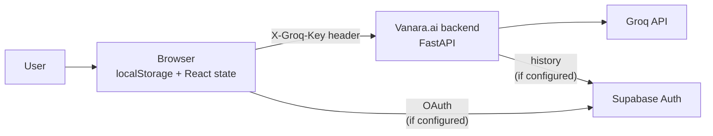
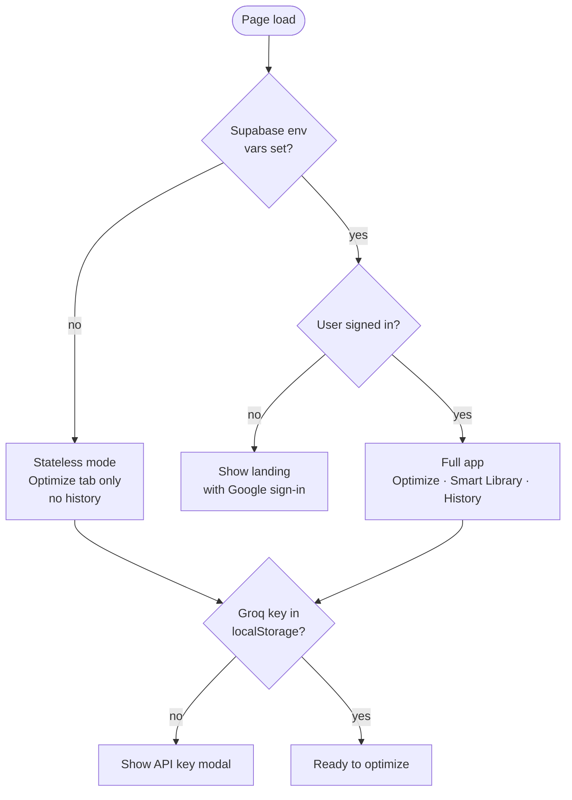
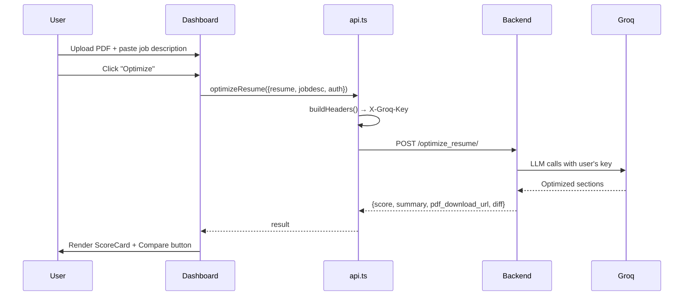

# Vanara.ai Frontend: Architecture

This document describes the frontend architecture: how the BYOK flow works,
where state lives, and how the app behaves in stateless vs. logged-in mode.
It complements `README.md` (setup and deployment).

## High-level flow



## Modes of operation



## Key architectural decisions

### BYOK (Bring Your Own Key)
- `contexts/ApiKeysContext.tsx` is the single source of truth for the Groq key.
- The key is stored in `window.localStorage` under `vanara.apiKeys.groq`.
- On every backend request, `api.ts::buildHeaders()` attaches it as `X-Groq-Key`.
- The key **never** goes to a Vanara-owned server. It is only sent to the
  backend URL the user points the app at (`NEXT_PUBLIC_API_BASE_URL`).

### Optional Supabase auth
- `contexts/AuthContext.tsx` exposes `supabaseEnabled`, which is `true` only when both
  `NEXT_PUBLIC_SUPABASE_URL` and `NEXT_PUBLIC_SUPABASE_ANON_KEY` are set at
  build time.
- When disabled, the UI hides the History and Smart Library tabs and shows a
  "stateless mode" note. The Optimize flow still works end-to-end.
- Sign-in uses Google OAuth via Supabase's `signInWithOAuth` with a
  `redirectTo=/dashboard` callback.

### State management
- **No Redux / Zustand / Jotai.** Component-local `useState` + two React
  contexts (`AuthContext`, `ApiKeysContext`) cover all needs.
- Server state (history, parsed resumes) is re-fetched on tab switch via
  `api.ts` functions. No client-side cache layer.

### Styling
- Tailwind CSS 4 with explicit dark mode (`dark:` variants).
- Framer Motion (`motion/react`) for entrance animations and the score-ring
  draw. Shared `EASE = [0.22, 1, 0.36, 1]` constant across components.
- Heroicons (outline) for all iconography.

## Component tree

```
app/
├── layout.tsx                  : Root: Geist fonts, ThemeProvider, AuthProvider, ApiKeysProvider
├── page.tsx                    : Landing: hero, story, how-it-works, logos
├── dashboard/
│   ├── page.tsx                : Main dashboard (Optimize · Parsed · History tabs)
│   └── FeedbackFAB.tsx         : Floating action button for bug / feature / feedback
├── auth/callback/route.ts      : Supabase OAuth exchange
├── components/
│   ├── InlineResumePicker.tsx  : Tab between upload PDF vs. pick from library
│   ├── ResumeUploader.tsx      : Drag-and-drop PDF input
│   ├── JobDetailsInput.tsx     : Title / company / description fields
│   ├── TemplateSelector.tsx    : Elegant vs. classic template cards
│   ├── ScoreCard.tsx           : Animated ATS ring + strengths/gaps
│   ├── ResumeComparison.tsx    : Section-by-section diff
│   ├── ResumeHistory.tsx       : Paginated history list
│   ├── ParsedResumeManager.tsx : Smart Library CRUD
│   ├── ResumePreviewModal.tsx  : Preview parsed resume as structured doc
│   ├── ApiKeysModal.tsx        : Set / manage / clear Groq key
│   ├── ThemeToggle.tsx         : Light / dark / system mode toggle
│   └── VanaraLogo.tsx          : Brand text
└── api.ts                      : Backend API client
contexts/
├── AuthContext.tsx             : Optional Supabase auth (exposes supabaseEnabled flag)
├── ApiKeysContext.tsx          : BYOK localStorage-backed store for the Groq key
└── ThemeContext.tsx            : Light / dark / system theme state
lib/
├── supabase.ts                 : Supabase client (null when env vars unset)
├── filename.ts                 : Pure download-filename builder (testable)
└── validateGroqKey.ts          : Groq API key format validator
```

## Request example: Optimize



## See also

- `README.md`: quickstart, environment variables, deployment
- `CONTRIBUTING.md`: development workflow
- `SECURITY.md`: vulnerability reporting
